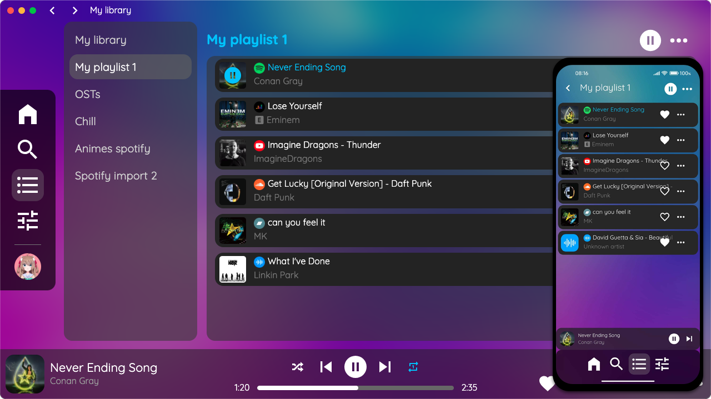

# AyMusic-WebAssets

AyMusic allows you to create playlists with music on **Spotify, Youtube, Deezer, Soundcloud, Bandcamp and locally from your computer or mobile**. You can use this application if you want to create a playlist of music on Spotify but there's some music that you can't find on Spotify but on another platform.

With AyMusic you can do this without any problems. Create a playlist, add your music to one platform and then add it to other platforms and AyMusic will play your favourite music!

This repository is all the web assets for AyMusic app.

## Other repos
- [Windows/Linux/MacOS application of AyMusic using Electron](https://github.com/Shiyukine/AyMusic-Electron)
- [Android application of AyMusic](https://github.com/Shiyukine/AyMusic-Android)
- [iOS application of AyMusic](https://github.com/Shiyukine/AyMusic-iOS)